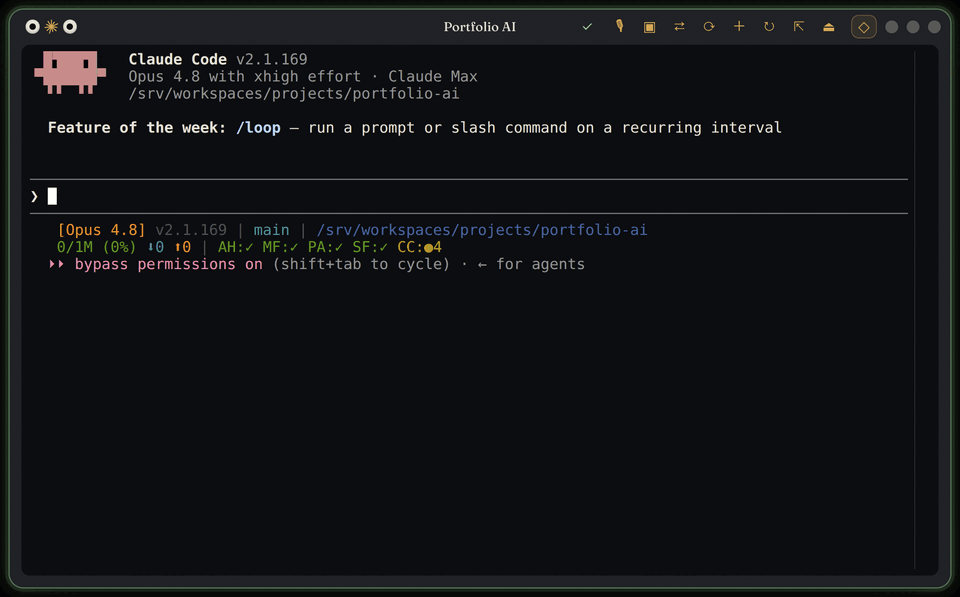

# Aico

Aico is a Linux desktop companion for people working with terminal AI tools. Floating Electron widgets wrap persistent tmux sessions and let users send selected browser or desktop context into a running agent without leaving their work.



## What it does

- Hosts Claude Code, Codex, Gemini/Antigravity, Pi, and shells in movable terminal widgets.
- Preserves owned server-generation, session, and pane identities across detach/reopen and reports targeted lifecycle diagnostics.
- Offers a command palette, workspace picker, scrollback, browser selection capture, and optional desktop capture or voice dictation.
- Verifies configured agent context hooks before launch and can attach compatible external tmux sessions.

## Current scope

Aico targets a single-user Linux desktop. X11 is the best-supported path for global shortcuts and desktop capture; Wayland has limitations. The optional MV3 extension is loaded unpacked for development. macOS, Windows, and `.deb` packaging are not implemented.

## Getting started

Download an AppImage and `SHA256SUMS.txt` from [Releases](https://github.com/elias-leslie/aico/releases/latest):

```bash
sha256sum -c SHA256SUMS.txt
chmod +x Aico-*.AppImage
./Aico-*.AppImage
```

The AppImage bundles Electron and the sidecar and does not require Node.js, Python, `uv`, or a virtualenv at runtime. It still requires tmux, the AI CLIs you launch, Electron's Linux system libraries, and the durable-session prerequisites below.

For a source install:

```bash
git clone https://github.com/elias-leslie/aico.git
cd aico
scripts/aico-install.sh
scripts/aico-launch.sh
```

The installer also installs the `aico-shell.service` and `aico-owner.service` user units for this checkout. It prints any `sudo` step (Electron's `chrome-sandbox` helper, and an AppArmor profile on kernels that restrict user namespaces) and runs it only after an interactive yes or with `AICO_INSTALL_PRIVILEGED=1`. Configuration comes from environment variables, not a `.env` file.

Source builds additionally need Node.js 22+, npm, Python 3.13+, uv, and native `node-pty` build tools. The [project guide](docs/project-guide.md) retains packaging and installation details.

## Runtime, data, and integrations

New durable sessions require a systemd 254+ user manager, cgroup v2, tmux per-pane scopes, and user lingering. They fail closed when containment cannot be verified; existing work is preserved. Historical sessions remain lifecycle-read-only. The source installer enables and verifies lingering.

The sidecar binds to `127.0.0.1:8005`, rejects non-local browser origins, and stores selection history in SQLite and widget events in JSONL under `~/.local/state/aico` by default. AI provider credentials belong to each CLI. Missing ST catalog/capture tooling leaves core widgets and Personal Workspace working; missing voice service affects dictation only. A-Term can expose attached terminals through its separately authenticated browser workspace.

## Development and verification

```bash
st pulse --gate
st check --quick --changed-only
npm run check
```

The npm gate runs lint, type checks, renderer tests, sidecar tests, and build. Lifecycle and packaged-app verification use the documented targeted harnesses; avoid broad process-name cleanup. No runtime rebuild is needed for documentation changes.

## Documentation

- [Project guide](docs/project-guide.md) for features, configuration, APIs, packaging, and limitations.
- [Source installation](docs/INSTALL.md) and [browser extension](extension/README.md).
- [Lifecycle harness](docs/LIFECYCLE_HARNESS.md) and [process incident/recovery report](docs/INCIDENT-2026-07-PROCESS-ESCAPES.md).
- [Security](SECURITY.md), [Apache 2.0 license](LICENSE), [notice](NOTICE), and [font licenses](assets/fonts/README.md).
